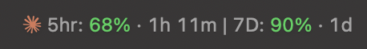
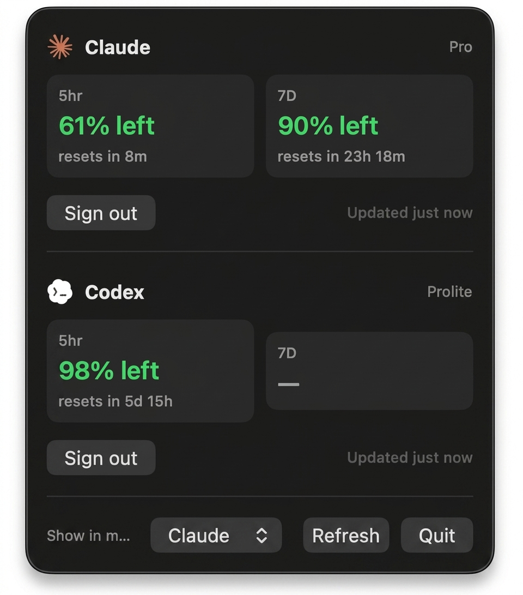

# LimitMeter

A small **macOS menu bar** app that shows how much of your **Claude** and **Codex** subscription limits you have left — the rolling **5-hour** window and the **7-day** window — at a glance.

No Dock icon. Click the status item for details.

<p align="center">
  
</p>

<p align="center">
  
</p>

## What you get

- Live **% left** for 5hr and 7D (green → amber → red as you run low)
- **Reset countdown** under each limit (e.g. `resets in 1h 11m`)
- Choose which provider appears in the menu bar (Claude or Codex)
- One-click connect if you already use **Claude Code** or **Codex CLI**

## Requirements

- macOS 14 Sonoma or later
- [Xcode Command Line Tools](https://developer.apple.com/xcode/) (or full Xcode) so `swift` works

```bash
xcode-select --install   # only if `swift` is not already available
```

## Install & run

```bash
git clone https://github.com/sandjaie/LimitMeter.git
cd LimitMeter

./scripts/package-app.sh
open .build/LimitMeter.app
```

Look in the **menu bar** (top-right of the screen). There is no Dock icon.

| Action | How |
|--------|-----|
| Open details | Click the menu bar item |
| Switch menu bar provider | Popover → **Show in menu bar** |
| Refresh now | **Refresh** |
| Quit | **Quit** (or `pkill -f LimitMeter.app`) |

Optional — keep it handy:

```bash
cp -R .build/LimitMeter.app /Applications/
# Then: System Settings → General → Login Items → add LimitMeter
```

## Connect your accounts

### Claude (Pro / Max)

1. Sign in to **Claude Code** on this Mac (once).
2. Open LimitMeter → under Claude, click **Connect**.
3. Choose **Use Claude Code login**.

macOS may ask once for Keychain access to **Claude Code-credentials** — choose **Always Allow**.

#### Claude rate-limit fallback (recommended)

If Anthropic’s usage API returns 429, LimitMeter can read the same numbers Claude Code already puts in its statusline, via `~/.claude/usage-cache.json`:

```bash
brew install jq   # once
./scripts/install-claude-usage-cache.sh
```

That wraps your Claude Code `statusLine` so it keeps the cache fresh. Open Claude Code and send a message once so `rate_limits` appear. LimitMeter then shows *“From Claude Code cache”* instead of a hard rate-limit error when the live API is throttled.

### Codex

1. Sign in with the **Codex CLI** on this Mac (creates `~/.codex/auth.json`).
2. In LimitMeter → **Connect** under Codex → **Use Codex CLI login**.

### Sign out

Use **Sign out** on that provider’s row. LimitMeter won’t auto-reconnect until you Connect again.

Sessions are stored in `~/Library/Application Support/LimitMeter/` (mode `0600`).

## Everyday use

Menu bar format (example):

`5hr: 68% · 1h 11m | 7D: 90% · 1d`

Limits refresh about every **4 minutes** while the app is running (and slower if rate-limited). Colors move green → amber → red as remaining % drops.

## Develop / contribute

```bash
brew install swiftformat swiftlint   # required for the commit gate
./scripts/setup-hooks.sh             # once per clone — required
./scripts/check.sh                   # format + lint + tests (same as pre-commit)
swift test
```

Git workflow, required hooks, and PR expectations: [`CONTRIBUTING.md`](CONTRIBUTING.md).  
Architecture & settings reference: [`docs/architecture.md`](docs/architecture.md).  
Agent/project contract: [`AGENTS.md`](AGENTS.md).

### Xcode (optional)

```bash
xcodegen generate   # if you use project.yml
open LimitMeter.xcodeproj
```

If `xcodebuild` fails on your machine (some Xcode 26 / simulator plugin issues), use `swift build` / `./scripts/package-app.sh` instead.

## Notes

- Usage comes from the same unofficial endpoints the official apps use; they can change.
- Codex may only expose a weekly window on some plans — 5hr shows `—` when unavailable.
- For personal local use with your own subscription login.
