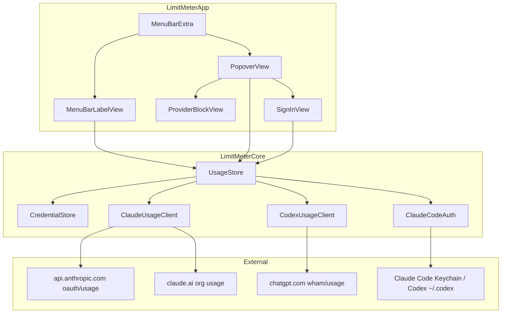

# LimitMeter Architecture

Operational reference for how the app is structured, where settings live, and the behaviors that matter when changing code or debugging. For product history see [`superpowers/specs/2026-09-05-limitmeter-design.md`](superpowers/specs/2026-09-05-limitmeter-design.md). For agent rules see [`../AGENTS.md`](../AGENTS.md).

## What it is

Native **macOS menu-bar** app (`LSUIElement`, no Dock icon) that shows **Claude** and **Codex** subscription usage: **5-hour** and **7-day** remaining %, reset countdowns, and plan labels. Click the status item for a stacked popover of both providers.

Bundle ID: `dev.limitmeter.app`  
Platform: macOS 14+  
Stack: Swift / SwiftUI + SwiftPM (`LimitMeterCore` library + `LimitMeter` executable)

## Architecture overview



```
MenuBarExtra → PopoverView / MenuBarLabelView
       ↓
   UsageStore (@Observable, @MainActor)
       ↓
 ClaudeUsageClient | CodexUsageClient
       ↓
 CredentialStore + Claude Code / Codex CLI import
```

**Rules of the architecture**

- One shared store owns both provider snapshots and the poll loop.
- Clients are isolated: a Claude failure must not blank Codex (and vice versa).
- UI never talks to HTTP directly; only through `UsageStore`.

## Repository layout

| Path | Role |
|------|------|
| `LimitMeter/` | Core library (`LimitMeterCore`): models, store, clients, auth, formatting, networking |
| `LimitMeterApp/` | Executable: `MenuBarExtra`, SwiftUI views, logo resources |
| `LimitMeterTests/` | Unit tests + sanitized JSON fixtures |
| `Package.swift` | Preferred build / test entry |
| `project.yml` | Optional XcodeGen project |
| `scripts/package-app.sh` | Build + wrap `.build/LimitMeter.app` |
| `scripts/check.sh` | Pre-commit quality gate |
| `.githooks/` | Repo-managed git hooks |

### Core modules

| File | Responsibility |
|------|----------------|
| `Store/UsageStore.swift` | Snapshots, polling, credential resolve, last-known merge, UserDefaults |
| `Providers/ClaudeUsageCache.swift` | Read `~/.claude/usage-cache.json` (statusline fallback) |
| `Providers/ClaudeUsageClient.swift` | Claude OAuth + cookie usage APIs + cache fallback |
| `Providers/CodexUsageClient.swift` | ChatGPT/Codex wham usage + `~/.codex/auth.json` import |
| `Auth/KeychainStore.swift` | **`CredentialStore`** — Application Support session files |
| `Auth/ClaudeCodeAuth.swift` | Import Claude Code OAuth (Keychain / `~/.claude`) |
| `Auth/SessionCredential.swift` | `{ token, accountID?, updatedAt }` |
| `Models/UsageModels.swift` | `ProviderID`, `LimitWindow`, `ProviderUsage`, `FetchStatus` |
| `Networking/HTTPClient.swift` | `HTTPPerforming` / `URLSessionHTTPClient` |
| `Formatting/UsageFormatting.swift` | Remaining %, countdown, menu-bar string |
| `Formatting/LimitColor.swift` | Green / amber / red thresholds |
| `Formatting/FetchErrorCopy.swift` | User-facing error strings |

## Data model

```swift
enum ProviderID { case claude, case codex }

struct LimitWindow {
  var remainingPercent: Double   // 0...100 — always "left", never "used"
  var resetsAt: Date
}

enum FetchStatus {
  case ok
  case needsAuth
  case error(String)             // user-facing copy from FetchErrorCopy
}

struct ProviderUsage {
  var provider: ProviderID
  var planLabel: String?
  var fiveHour: LimitWindow?
  var sevenDay: LimitWindow?
  var fetchedAt: Date
  var status: FetchStatus
  var isSignedIn: Bool
}
```

If an API returns **utilization used**, convert before display:

`remaining = 100 - used`

## Settings & persisted state

### UserDefaults

| Key | Type | Default | Meaning |
|-----|------|---------|---------|
| `menuBarProvider` | `String` (`claude` / `codex`) | `claude` | Which provider’s snapshot fills the menu bar |
| `optOut.claude` | `Bool` | `false` (absent) | After **Sign out**, block auto-import of Claude Code login |
| `optOut.codex` | `Bool` | `false` (absent) | After **Sign out**, block auto-import of Codex CLI login |

There is **no** UserDefaults key for poll interval (hardcoded in `UsageStore`).

### Session files (LimitMeter’s own credentials)

| Item | Value |
|------|--------|
| Directory | `~/Library/Application Support/LimitMeter/` |
| Files | `claude-session.json`, `codex-session.json` |
| Format | JSON `SessionCredential` |
| Permissions | `0600` (+ file protection until first unlock) |

**Important:** Despite historical names (`KeychainStore` typealias, older docs), **LimitMeter does not store its sessions in the macOS Keychain.** Application Support avoids repeated Keychain ACL prompts on ad-hoc SwiftPM builds. The Keychain is only used to *read* Claude Code’s existing credentials.

### External logins (import sources)

| Provider | Source | Notes |
|----------|--------|--------|
| Claude | Keychain service `Claude Code-credentials`, or `~/.claude/.credentials.json` / `credentials.json` | Reads `claudeAiOauth.accessToken`; plan → `accountID` like `oauth:pro` |
| Codex | `~/.codex/auth.json` | `tokens.access_token` (+ optional account id fields) |

**Sign out** deletes the App Support file and sets `optOut.* = true` so the next launch does **not** immediately re-import CLI/Claude Code credentials. **Connect** / save clears the opt-out flag.

## Networking

### Claude

| Mode | When | Endpoint | Auth |
|------|------|----------|------|
| OAuth | `accountID` starts with `oauth`, or token looks like OAuth (not a cookie) | `GET https://api.anthropic.com/api/oauth/usage` | `Authorization: Bearer …`, `anthropic-beta: oauth-2025-04-20` |
| Cookie | Real org id present (not `oauth*`) | `GET https://claude.ai/api/organizations/{orgID}/usage` | `Cookie`, Referer settings/usage |

Payload windows: `five_hour`, `seven_day` (`utilization`, `resets_at`).

#### Claude local cache fallback

When the live Claude usage request fails (429, 5xx, offline, timeout) — **not** 401/403 — LimitMeter tries:

`~/.claude/usage-cache.json`

| Field | Meaning |
|-------|---------|
| `five_hour_pct` / `seven_day_pct` | **Used** % (0–100), or `null` |
| `five_hour_reset` / `seven_day_reset` | Unix epoch, or `null` |
| `updated_at` | Unix epoch when statusline last wrote |

Accepted only if `updated_at` is within **6 hours** and at least one window is non-null. Display converts used → remaining. UI sets `dataSource = .localCache` and shows *“From Claude Code cache”*. Partial cache snapshots **merge** with the previous in-memory windows so a statusline tick that omits `five_hour` does not wipe a known 5hr value. The cache writer also merges on disk (never overwrites a window with null).

This file is written by Claude Code’s **statusline** (stdin `rate_limits`), not by scanning JSONL logs.

Install / wrap statusline (idempotent):

```bash
./scripts/install-claude-usage-cache.sh
```

Installs `~/.claude/limitmeter-write-usage-cache.sh` and prefixes `statusLine.command` with it (backs up `settings.json`).

### Codex

| Endpoint | Auth |
|----------|------|
| `GET https://chatgpt.com/backend-api/wham/usage` | `Authorization: Bearer …`, optional `ChatGPT-Account-Id` |

Payload: rate-limit windows classified by `limit_window_seconds` (≤12h → 5hr, longer → 7D), not by `primary`/`secondary` field names. Some plans (e.g. Prolite) only expose weekly in `primary_window` → 5hr shows `—`.

These are the same **unofficial** surfaces the official apps use; they can change without notice.

## Polling & refresh

| Constant | Value | Location |
|----------|-------|----------|
| Base poll interval | **240 seconds** | `UsageStore.startPolling(intervalSeconds:)` |
| Rate-limit backoff | **300 seconds** | `UsageStore.rateLimitPollSeconds` |

Behavior:

1. On popover `.task`, `startPolling()` runs an immediate `refreshAll()`, then sleeps.
2. Each cycle refreshes **Claude and Codex in parallel**.
3. If either snapshot’s error message is rate-limited, **or** Claude is serving from the local cache, the next sleep is `max(base, 300)`.
4. Footer **Refresh** calls `refreshAll()` immediately (does not wait for the timer).

## Error handling

| HTTP / condition | Status | User copy (typical) |
|------------------|--------|---------------------|
| 401 / 403 | `.needsAuth` | Connect affordance |
| 429 | `.ok` + cache if fresh, else `.error` | Cache caption, or rate-limit message (orange) |
| 5xx / offline / timeout | same cache preference | Cache caption, or friendly error |
| Bad JSON | `.error` | Couldn’t read usage data |
| Other HTTP | `.error` | Couldn’t load usage (error N) |

**Last-known retention:** on `.error` or `.needsAuth`, `UsageStore.preservingLastKnown` keeps previous `fiveHour` / `sevenDay` / `planLabel` when the new snapshot omits them. The popover adds *“Showing last known values.”* when tiles are still filled.

## UI behavior

### Menu bar

- Format: `5hr: 68% · 1h 11m | 7D: 90% · 1d`
- **Never** include the word “resets”
- Missing window: `—`
- Not connected: `{Provider} · Connect`
- Percent colors: ≥40 green, 15..<40 amber, &lt;15 red; auth/unknown → secondary
- Label is rendered as a **colored `NSImage`** (`MenuBarLabelView`) so MenuBarExtra does not force template/monochrome text

### Popover

- Stacked: Claude block, then Codex
- Tiles: `{pct} left` + `resets in {countdown}` (popover **may** say “resets”; menu bar must not)
- Per provider: Connect / Sign out + relative “Updated …”
- Footer: **Show in menu bar** picker · Refresh · Quit

## Auth UX flow

1. Prefer **Use Claude Code login** / **Use Codex CLI login**.
2. Advanced paste remains available (token + optional account/org).
3. First Claude Code import may prompt once for Keychain access to `Claude Code-credentials` → **Always Allow**.

## Build & run

```bash
swift build
swift test
./scripts/package-app.sh          # → .build/LimitMeter.app
open .build/LimitMeter.app
./scripts/check.sh                # format + lint + tests (pre-commit)
```

Prefer SwiftPM over `xcodebuild` (some Xcode 26 installs break simulator plugins). Optional: `xcodegen generate` + open the `.xcodeproj`.

Packaged app is **ad-hoc codesigned** (`codesign --sign -`) for local use.

## Product invariants (do not break)

- Display **remaining** %, not used %.
- Menu bar copy shape without the word “resets”.
- Color thresholds: ≥40 / 15..<40 / &lt;15.
- Default menu-bar provider: Claude.
- One provider failing must not blank the other.
- Never commit real tokens, cookies, org/account IDs, or Keychain dumps; fixtures stay sanitized.

## Out of scope (v1)

- Anthropic / OpenAI **API org billing** dashboards
- Browser-extension bridges
- Push notifications
- Non-macOS platforms
- Local JSONL token-log estimates as the primary meter
- Cloud CI (quality gate is local hooks)

## Debugging cheat sheet

| Symptom | Likely cause |
|---------|----------------|
| Red/orange rate-limit copy | Anthropic 429 and no fresh `usage-cache.json` — run `./scripts/install-claude-usage-cache.sh`, use Claude Code once |
| “From Claude Code cache” | Live API failed; showing statusline cache (≤6h old) |
| `—` tiles but signed in | Fetch failed with no prior snapshot, or window absent from payload |
| Connect loop after Sign out | Expected until user Connects; `optOut.*` blocks auto-import |
| Claude Code connect fails | Not signed into Claude Code, or Keychain access denied |
| Codex connect fails | Missing/invalid `~/.codex/auth.json` |
| Menu bar % always gray | Label falling back to template rendering — check `MenuBarLabelView` image path |
| Logos missing | Run via `package-app.sh` so Resources/bundle are inside the `.app` |

## Related docs

| Doc | Purpose |
|-----|---------|
| [`../README.md`](../README.md) | Install & end-user usage |
| [`../CONTRIBUTING.md`](../CONTRIBUTING.md) | Git workflow & required hooks |
| [`../AGENTS.md`](../AGENTS.md) | Contract for coding agents |
| [`superpowers/specs/2026-09-05-limitmeter-design.md`](superpowers/specs/2026-09-05-limitmeter-design.md) | Original design decisions |
